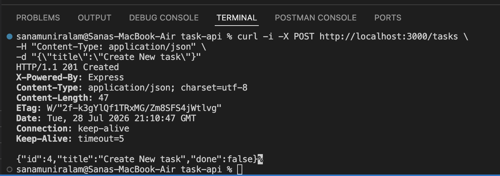
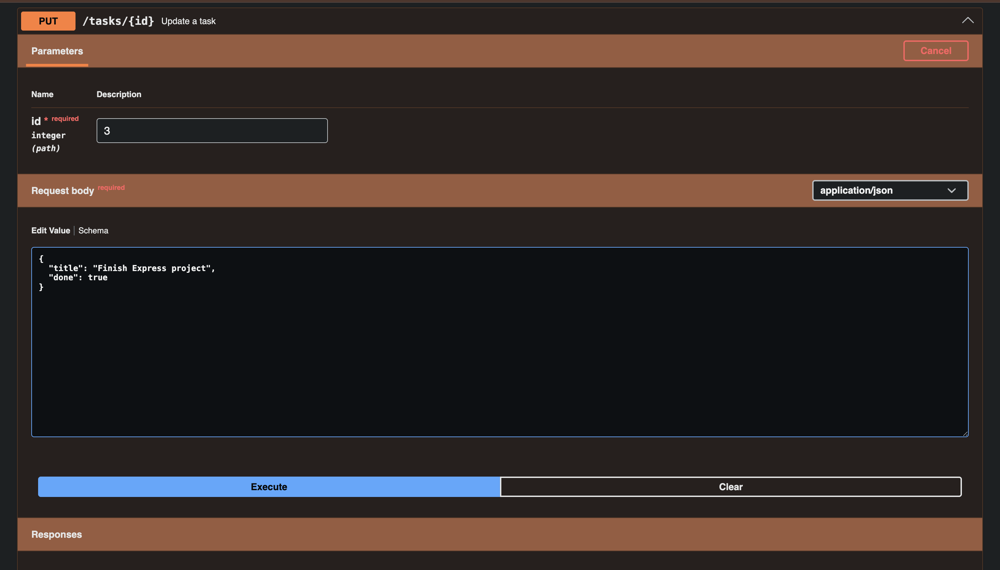
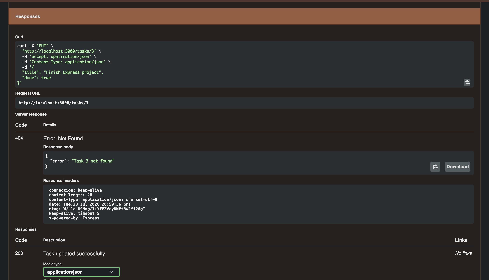
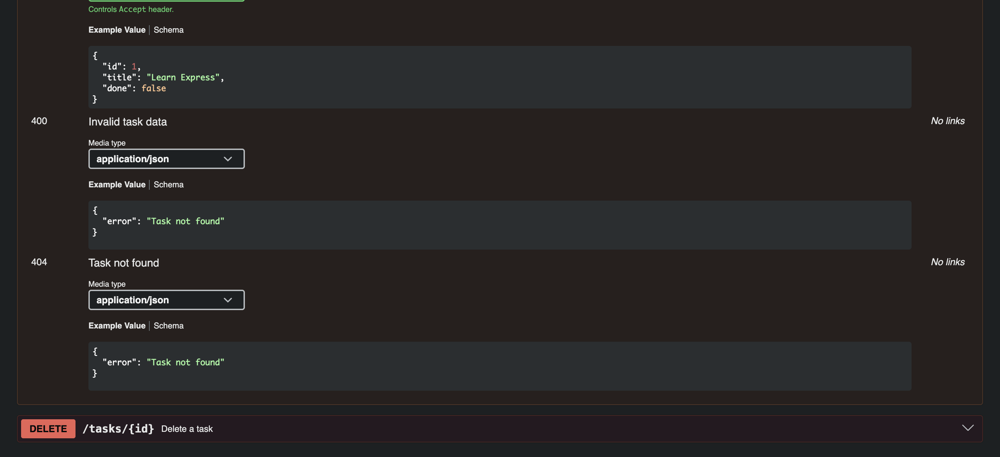

# Task API

A simple RESTful CRUD API built using **Node.js** and **Express.js**. The API manages an in-memory list of tasks and supports creating, reading, updating, and deleting tasks. Interactive API documentation is provided using **Swagger UI**.

> **Note:** This project stores data in memory only. Any tasks created or updated are lost when the server is restarted.

---

## Technologies Used

* Node.js
* Express.js
* Swagger UI Express
* OpenAPI 3.0

---

## Installation

Clone the repository and install the dependencies:

```bash
npm install
```

---

## Running the Server

Start the server using:

```bash
node index.js
```

The server will run at:

```
http://localhost:3000
```

Swagger UI is available at:

```
http://localhost:3000/api-docs
```

---

## API Endpoints

| Method | Endpoint     | Description                      |
| ------ | ------------ | -------------------------------- |
| GET    | `/`          | Returns API information          |
| GET    | `/health`    | Returns the server health status |
| GET    | `/tasks`     | Returns all tasks                |
| GET    | `/tasks/:id` | Returns a single task by ID      |
| POST   | `/tasks`     | Creates a new task               |
| PUT    | `/tasks/:id` | Updates an existing task         |
| DELETE | `/tasks/:id` | Deletes a task                   |

---

## Example Request

Create a new task:

```bash
curl -i -X POST http://localhost:3000/tasks \
-H "Content-Type: application/json" \
-d '{"title":"Create New Task"}'
```

### Example Response

```http
HTTP/1.1 201 Created
Content-Type: application/json; charset=utf-8

{
  "id": 4,
  "title": "Create New Task",
  "done": false
}
```

---

## Swagger UI

Swagger UI provides interactive documentation for all available endpoints. It allows every endpoint to be tested directly from the browser without using curl.








---

## Project Structure

```
task-api/
│
├── index.js
├── openapi.json
├── package.json
├── package-lock.json
├── README.md
```

---

## Features

* Full CRUD functionality
* In-memory task storage
* Input validation for POST, PUT, and query parameters
* Appropriate HTTP status codes
* JSON responses
* Interactive Swagger documentation

---

## Design Decisions

* **In-memory data storage:** Tasks are stored in a JavaScript array rather than a database. This matches the assignment requirements and demonstrates how CRUD operations work before introducing persistent storage. As expected, all data is reset when the server restarts.

* **Robust ID generation:** Instead of assigning IDs using `tasks.length + 1`, the API calculates the next ID as the maximum existing ID plus one. This prevents duplicate IDs if tasks have been deleted before new ones are created.

* **Input validation:** Both `POST` and `PUT` validate incoming data before modifying the task list. Empty or whitespace-only titles are rejected using `trim()`, ensuring only meaningful task titles are accepted. Updates also validate that `done` is a boolean value. Query parameters are also validated, ensuring that done only accepts true or false and that empty search queries are rejected with a 400 Bad Request response.

* **Meaningful HTTP responses:** The API returns appropriate HTTP status codes for every operation (`200`, `201`, `204`, `400`, and `404`) together with JSON error messages where applicable. This makes the API predictable and easier for clients to consume while following common REST practices.

---

## HTTP Status Codes Used

| Status Code | Meaning                        |
| ----------- | ------------------------------ |
| 200         | Request completed successfully |
| 201         | Task created successfully      |
| 204         | Task deleted successfully      |
| 400         | Invalid request data           |
| 404         | Task not found                 |


## Optional Extras

### Filtering and Search

The `/tasks` endpoint supports optional query parameters.

- `?done=true` returns completed tasks.
- `?done=false` returns incomplete tasks.
- `?search=keyword` returns tasks whose title contains the given keyword.
- Both filters can be combined in the same request.

...

### Task Statistics

The `/stats` endpoint computes task statistics directly from the in-memory task list.

Example response:

- Total tasks
- Completed tasks
- Open tasks

...

### Reset Sample Data

The `/reset` endpoint restores the original three sample tasks stored in memory. This is useful for demonstrations and testing without restarting the server.

...

### Memory Persistence Experiment

I created several new tasks using the POST endpoint and confirmed they were present using `GET /tasks`. After restarting the server, the newly created tasks disappeared and only the original sample tasks remained.

This happens because the application stores its data only in memory. When the Node.js process stops, the in-memory array is recreated from scratch, so any runtime changes are lost. This demonstrates why persistent storage (introduced in the next assignment) is necessary.