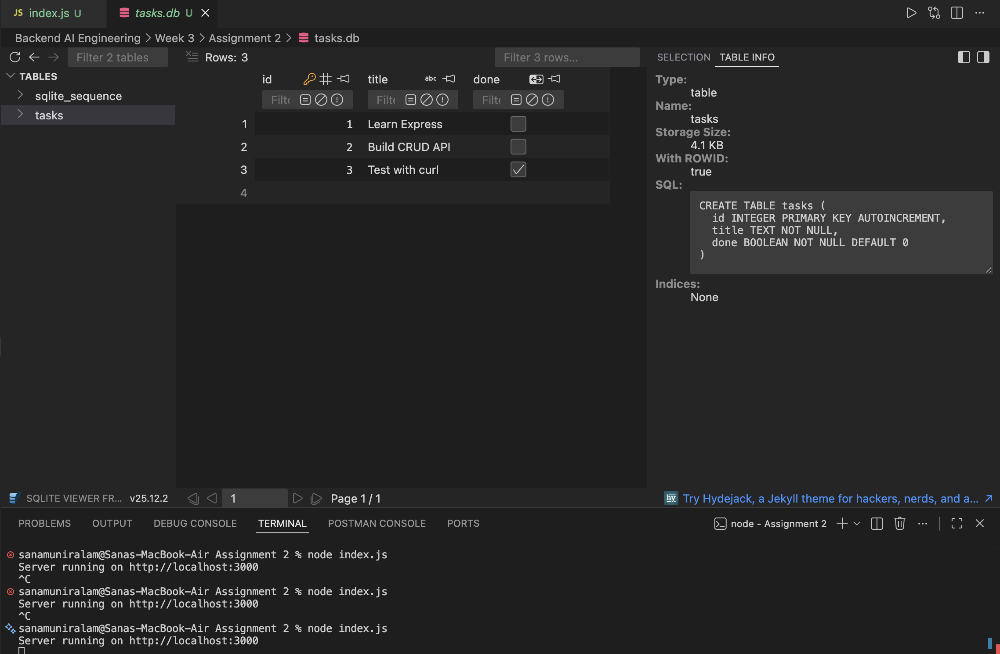
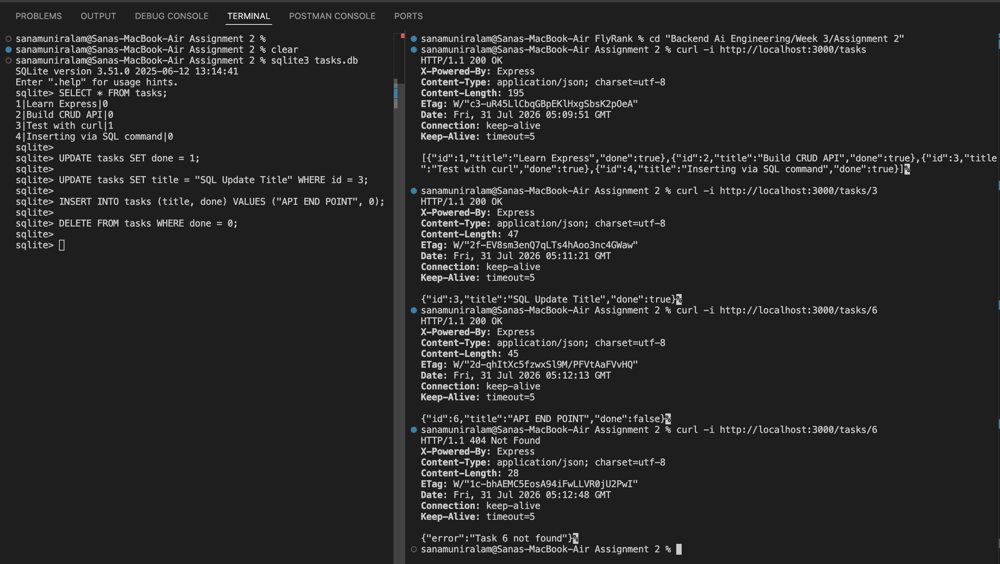
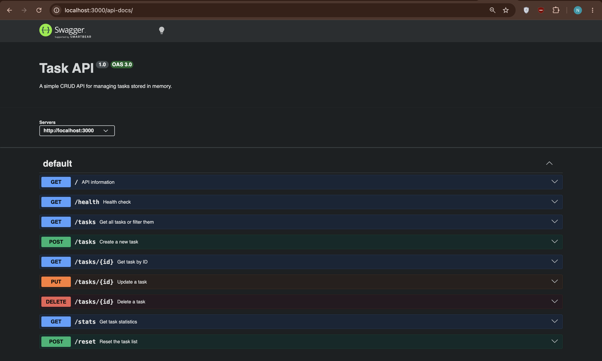

# Task API

A simple RESTful CRUD API built using **Node.js**, **Express.js**, and **SQLite**. The API manages a persistent list of tasks stored in a SQLite database and supports creating, reading, updating, and deleting tasks. Interactive API documentation is provided using **Swagger UI**.

> **Note:** Tasks are stored in a SQLite database (`tasks.db`), so all changes persist even after the server is restarted.

---

## Technologies Used

- Node.js
- Express.js
- SQLite
- better-sqlite3
- Swagger UI Express
- OpenAPI 3.0

---

## Why SQLite?

SQLite was chosen because it is a lightweight, serverless relational database that stores all data inside a single file. It requires no separate database server or additional configuration, making it ideal for small backend projects and learning SQL. It also provides persistent storage, allowing task data to survive server restarts while keeping the API exactly the same as the in-memory version.

---

## Installation

```bash
npm install
```

---

## Running the Server

```bash
node index.js
```

The server runs at:
```text
http://localhost:3000
```

Swagger UI is available at:
```text
http://localhost:3000/api-docs
```

On the first run, the application automatically:
- Creates the `tasks.db` database if it does not already exist.
- Creates the `tasks` table if it is missing.
- Inserts three example tasks only when the table is empty.

---

## Database File

The SQLite database is stored in the project root as `tasks.db`. It is created automatically on first run. All CRUD operations read from and write to this file, so data persists across server restarts.



---

## API Endpoints

| Method | Endpoint | Description |
|--------|----------|-------------|
| GET | `/` | Returns API information |
| GET | `/health` | Returns the server health status |
| GET | `/tasks` | Returns all tasks |
| GET | `/tasks/:id` | Returns a task by ID |
| POST | `/tasks` | Creates a new task |
| PUT | `/tasks/:id` | Updates an existing task |
| DELETE | `/tasks/:id` | Deletes a task |

---

## Example Request

```bash
curl -i -X POST http://localhost:3000/tasks \
-H "Content-Type: application/json" \
-d '{"title":"Create New Task"}'
```

```http
HTTP/1.1 201 Created
Content-Type: application/json; charset=utf-8

{
  "id": 4,
  "title": "Create New Task",
  "done": false
}
```

---

## The Database Is the Source of Truth

Because the API is now a thin layer over SQLite, changes made directly to the database — with no code changes and no server restart — show up immediately through the API. This was verified by running a SQL command directly against `tasks.db`, then calling the same endpoint before and after:



This confirms the API layer and the storage layer are fully separate — the API describes *what* the app does, the database describes *where* it keeps its data.

---

## Swagger UI

Interactive documentation for every endpoint, with a "Try it out" button to test the full CRUD cycle from the browser.



---

## Project Structure

```text
task-api/
│
├── index.js
├── tasks.db
├── openapi.json
├── package.json
├── package-lock.json
├── README.md
└── screenshots/
```

---

## Features

- Full CRUD functionality
- SQLite database persistence
- Automatic database and table creation
- Automatic insertion of sample tasks on first run only
- Input validation for POST and PUT requests
- Appropriate HTTP status codes
- Interactive Swagger documentation

---

## Design Decisions

- **Persistent SQLite storage:** tasks are stored in SQLite instead of an in-memory array. The API's behavior is identical to Assignment 1 — only the storage layer changed.
- **Automatic database initialization:** the database and `tasks` table are created on first run if missing. Seed data is inserted only when the table is empty, preventing duplicate rows on restart.
- **ID generation:** SQLite's `AUTOINCREMENT` primary key assigns unique ids automatically — no manual id-tracking logic needed, unlike the in-memory version.
- **Input validation:** unchanged from Assignment 1 — empty/whitespace titles are rejected with `trim()`, and `done` must be a boolean on update.
- **Status codes:** `200`, `201`, `204`, `400`, `404` used consistently, each with a JSON error body where applicable.

---

## HTTP Status Codes Used

| Status Code | Meaning |
|-------------|---------|
| 200 | Request completed successfully |
| 201 | Task created successfully |
| 204 | Task deleted successfully |
| 400 | Invalid request data |
| 404 | Task not found |
