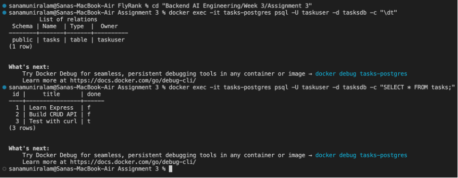
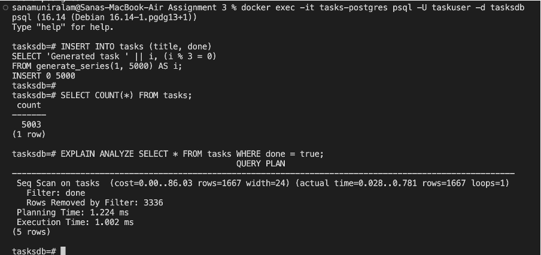
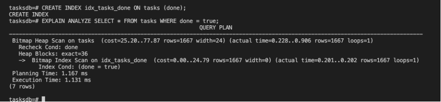

# Task API

A RESTful CRUD API built with **Node.js**, **Express.js**, and **PostgreSQL**, running as a fully containerized stack via **Docker Compose**. The API supports full CRUD, filtering, search, statistics, and reset — with data persisting in a real database server, not a file or memory. The stack also includes Redis (connectivity only, for a future assignment) and a dependency-aware health check.

> **Note:** Tasks are stored in PostgreSQL, running in its own Docker container with a named volume. The entire stack — app, database, and cache — starts with a single command.

---

## Technologies Used

- Node.js, Express.js
- PostgreSQL 16 (containerized)
- Redis 7 (containerized)
- Docker & Docker Compose
- `pg` (node-postgres driver), `redis` (Node client)
- Swagger UI Express, OpenAPI 3.0

---

## Why PostgreSQL + Docker?

PostgreSQL is a real database server, unlike SQLite's single-file storage — it's the same engine behind a large share of production backends. Running it in Docker means no manual Postgres installation: `docker compose up` brings up an identical database on any machine, killing "works on my machine" for good. A named Docker volume keeps the data on disk outside the container, so it survives even if the container is destroyed and rebuilt.

---

## Running the Whole Stack

```bash
cp .env.example .env
docker compose up
```

One command builds the app image, starts PostgreSQL and Redis, waits for Postgres to be genuinely ready (via a healthcheck), then starts the API. No manual database setup.

- API: `http://localhost:3000`
- Swagger UI: `http://localhost:3000/api-docs`

On first boot, the app automatically:
- Creates the `tasks` table if it doesn't exist
- Seeds three example tasks only if the table is empty
- Connects to Redis and logs a `PONG` on successful ping

To stop everything: `docker compose down` (add `-v` only if you want to wipe the database volume too — omit it to keep your data).

---

## Environment Variables

Copy `.env.example` to `.env` — the defaults work out of the box for local use:

| Variable | Purpose |
|---|---|
| `POSTGRES_USER` | Database username |
| `POSTGRES_PASSWORD` | Database password |
| `POSTGRES_DB` | Database name |
| `DATABASE_URL` | Full connection string (used when running the app outside Docker) |
| `PORT` | Port the API listens on |

`.env` is git-ignored; `.env.example` is committed with placeholder values so a stranger knows exactly what to set. Redis's connection address is set directly in code (`redis://redis:6379`, the compose service name) since it holds no secret worth externalizing for this stretch.

---

## API Endpoints

| Method | Endpoint | Description |
|--------|----------|-------------|
| GET | `/` | Returns API information |
| GET | `/health` | Reports app and database health (see below) |
| GET | `/tasks` | Returns all tasks; supports `?done=true/false` and `?search=keyword` |
| GET | `/tasks/:id` | Returns a task by ID |
| POST | `/tasks` | Creates a new task |
| PUT | `/tasks/:id` | Updates an existing task |
| DELETE | `/tasks/:id` | Deletes a task |
| GET | `/stats` | Returns `{ total, done, open }` |
| POST | `/reset` | Restores the three sample tasks |

---

## Example Request

```bash
curl -i -X POST http://localhost:3000/tasks \
-H "Content-Type: application/json" \
-d '{"title":"Create New Task"}'
```

```http
HTTP/1.1 201 Created
Content-Type: application/json; charset=utf-8

{
  "id": 4,
  "title": "Create New Task",
  "done": false
}
```

---

## Data in the Database

Verified directly with `psql` inside the running container:

```bash
docker exec -it tasks-postgres psql -U taskuser -d tasksdb -c "\dt"
docker exec -it tasks-postgres psql -U taskuser -d tasksdb -c "SELECT * FROM tasks;"
```



---

## Proving Persistence Across a Full-Stack Restart

The core requirement of this assignment: create data, tear down *both* containers, bring them back up, and confirm the data survived — because a named Docker volume, not the containers themselves, is what keeps the rows alive.

```bash
$ curl -i -X POST http://localhost:3000/tasks \
  -H "Content-Type: application/json" \
  -d '{"title":"Full stack persistence check"}'
HTTP/1.1 201 Created
{"id":4,"title":"Full stack persistence check","done":false}

$ docker compose down
 ✔ Container assignment3-api-1 Removed
 ✔ Container assignment3-db-1  Removed
 ✔ Network assignment3_default Removed

$ docker compose up
 ✔ Container assignment3-db-1  Created
 ✔ Container assignment3-api-1 Created
Container assignment3-db-1 Healthy
api-1  | Server running on http://localhost:3000

$ curl -i http://localhost:3000/tasks
HTTP/1.1 200 OK
[{"id":1,...},{"id":2,...},{"id":3,...},{"id":4,"title":"Full stack persistence check","done":false}]
```

Task 4 survived a complete teardown of both containers — proof the volume, not the running process, owns the data.

---

## Swagger UI


---

## The API Never Changed — Only the Storage Did

This is the third storage engine for the same API, in the same repo:

| Assignment | Where tasks live | What runs it |
|---|---|---|
| A1 | A JavaScript array | The Node process |
| A2 | A `tasks.db` file | SQLite, on disk |
| A3 (this) | Rows in a `tasks` table | PostgreSQL, in a container |

Across all three, the routes and their behavior — request shapes, response shapes, status codes — never changed. Only the code inside `tasksRepository.js` did. That's the actual point of a repository module: swapping storage should touch one file, not the routes built on top of it.

---

## Extra: A Real Health Check (and What Broke When I Built It)

`GET /health` doesn't just say "the process is running" — it actively runs `SELECT 1` against Postgres on every call, so it can tell the difference between "the app is up" and "the app is up but its database is unreachable."

```js
app.get("/health", async (req, res) => {
    try {
        await repository.checkDatabaseHealth();
        res.json({ status: "ok", db: "ok" });
    } catch (err) {
        res.status(503).json({ status: "ok", db: "unreachable" });
    }
});
```

`503 Service Unavailable` is used deliberately instead of `500` — it signals "I'm fine, but a dependency isn't," which is exactly what load balancers and orchestration tools (Kubernetes, AWS health checks) watch for to decide whether to keep routing traffic to an instance.

**Testing this the first time crashed the whole app**, not just the health route. Stopping the `db` container killed an *idle* connection in `pg`'s connection pool — not the one being actively queried — and `pg` emitted an unhandled `'error'` event on the pool itself. In Node, an unhandled `EventEmitter` error is fatal by default, so the entire `api` container crashed instead of the health check gracefully reporting `503`. The fix was a single listener in `db.js`:

```js
pool.on("error", (err) => {
    console.error("Unexpected error on idle database client:", err.message);
});
```

Verified both directions:

```bash
$ docker compose stop db
$ curl -i http://localhost:3000/health
HTTP/1.1 503 Service Unavailable
{"status":"ok","db":"unreachable"}

$ docker compose start db
$ curl -i http://localhost:3000/health
HTTP/1.1 200 OK
{"status":"ok","db":"ok"}
```

The app stayed alive through the outage both times — the fix works, and the failure mode it fixes is a real one, not a hypothetical.

---

## Extra: Index + `EXPLAIN ANALYZE`

To make the comparison meaningful, the table was seeded with 5,000 additional rows before measuring (removed afterward via `POST /reset`).

### Before: Sequential Scan (no index)



### After: Bitmap Heap Scan (with index on `done`)



Execution time barely changed (1.00ms → 1.13ms) even though the plan switched to a `Bitmap Heap Scan`. With `done` being a boolean and roughly a third of rows matching `true`, the index doesn't reduce how much data Postgres has to touch — this is a known limitation of indexing low-cardinality columns, and a good illustration that the query planner optimizes based on actual cost, not just "an index exists, therefore use it."

---

## Extra: Redis Added to the Stack

A `redis` service was added to `docker-compose.yml`, with the app connecting and pinging it once at startup — laying groundwork for caching in a later assignment, not implementing caching yet.

```bash
api-1 | Server running on http://localhost:3000
api-1 | Redis says: PONG
```

Connection uses the compose service name (`redis://redis:6379`), the same networking pattern as the `db` service — inside the compose network, containers reach each other by service name, not `localhost`. An error listener was attached to the Redis client from the start, applying the same lesson learned from the Postgres pool crash above rather than waiting to hit it a second time.

> **Note** Redis connectivity is scoped to the Docker Compose stack; running the app directly via node index.js outside Docker will not resolve the redis hostname, which is expected.

---

## Design Decisions

- **Repository pattern, enforced:** every database call lives in `tasksRepository.js`. Routes call repository functions and know nothing about SQL or which database engine is underneath.
- **Healthcheck on `db`, gating `api`'s startup:** `depends_on: condition: service_healthy` (not just `depends_on: [db]`) ensures the app doesn't attempt to connect until Postgres has actually finished its startup sequence — plain `depends_on` only waits for the container to exist, not for the database inside it to be ready.
- **No hardcoded secrets, including in `docker-compose.yml`:** credentials are referenced as `${POSTGRES_USER}` etc., substituted automatically from `.env` at compose time. The compose file itself, committed to git, contains no real password.
- **`RETURNING *` on INSERT/UPDATE:** Postgres hands back the affected row directly from the same query, removing the separate "insert, then fetch what I just inserted" step SQLite required.
- **Reset uses `TRUNCATE ... RESTART IDENTITY`:** unlike the A2 SQLite version (where reset tasks kept climbing ids, e.g. 5, 6, 7), this resets the id sequence itself, so reset tasks always come back as 1, 2, 3.
- **Pool-level error handling:** both the Postgres pool and the Redis client have `.on("error", ...)` listeners, learned directly from a real crash during health-check testing rather than added defensively up front.
- **Naming:** container/database/volume names in this project (`tasks-postgres`, `tasksdb`, `taskuser`, `tasks-pgdata`) differ from example names used in some guides (`taskdb`, default `postgres` user) — an intentional choice, kept consistent across `.env`, `docker-compose.yml`, and all commands in this README.

---

## Optional Extras

### Filtering and Search
`?done=true/false` and `?search=keyword` on `GET /tasks`, both combinable, implemented as parameterized SQL `WHERE`/`LIKE` clauses.

### Task Statistics
`GET /stats` computes `{ total, done, open }` via `SELECT COUNT(*)` in Postgres, not application-level counting.

### Reset Sample Data
`POST /reset` truncates the table and reseeds the three example tasks, with ids reset to 1, 2, 3.

### Real Health Check, Index + `EXPLAIN ANALYZE`, Redis
See dedicated sections above.

---

## HTTP Status Codes Used

| Status Code | Meaning |
|---|---|
| 200 | Request completed successfully |
| 201 | Task created successfully |
| 204 | Task deleted successfully |
| 400 | Invalid request data |
| 404 | Task not found |
| 503 | Server running, but database unreachable |

---

## Project Structure

```text
Assignment 3/
├── index.js
├── db.js
├── tasksRepository.js
├── openapi.json
├── Dockerfile
├── docker-compose.yml
├── .dockerignore
├── .env.example
├── package.json
├── package-lock.json
├── README.md
└── screenshots/
```