# Testing

This document covers the manual test pass for AI Decision Flow. Each test names what it's checking, what was done, and what was observed. Screenshots referenced here live in `screenshots/` at the repo root.

## Test 1, basic successful chain

Three node chain, YES all the way through. Logs panel moved through pending, running, and completed for each node in order, edges animated along the taken path.

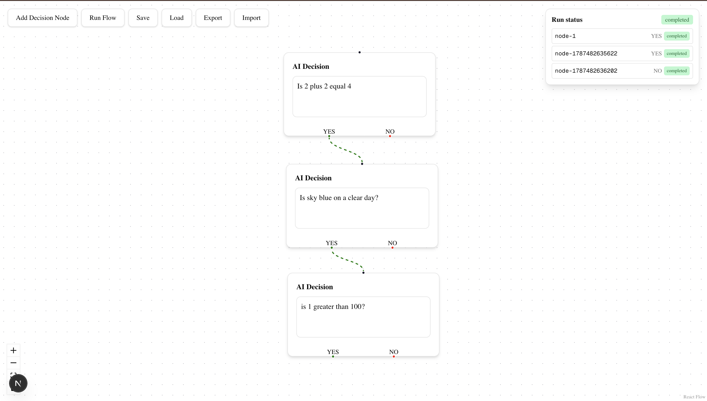

## Test 2, YES branch taken, NO branch skipped

Root node resolved YES. The NO sibling was immediately marked skipped rather than sitting at pending.

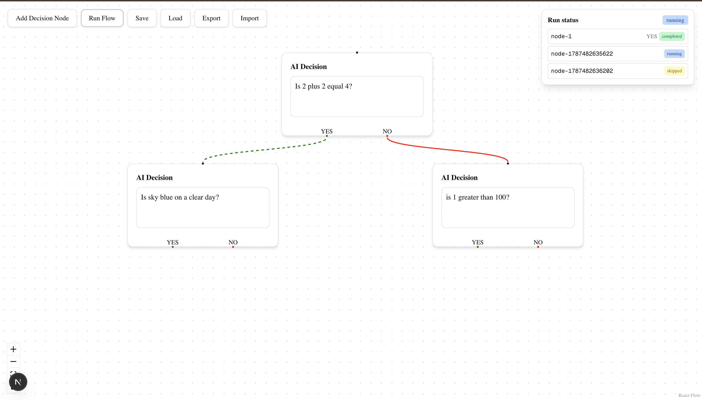

## Test 3, NO branch taken, YES branch skipped

Same shape in reverse, root resolved NO, the YES sibling was marked skipped immediately.

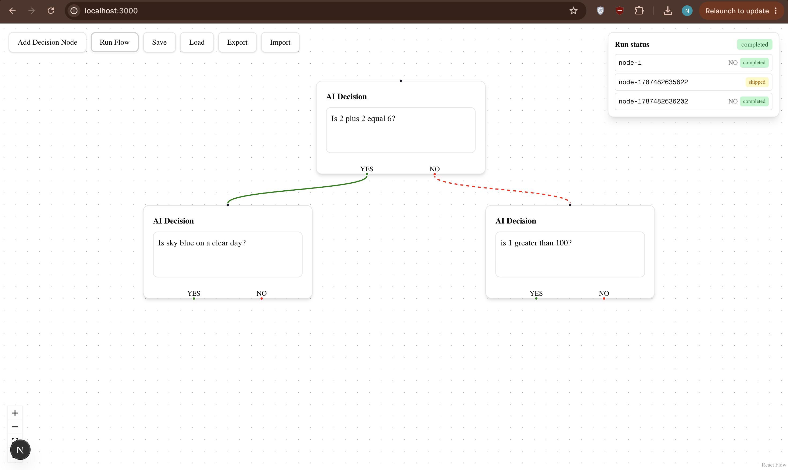

## Test 4, nested subtree skipping

A five node tree where the unselected branch itself has children. Confirms the skip walk correctly marks an entire unreached subtree, not only the direct sibling.

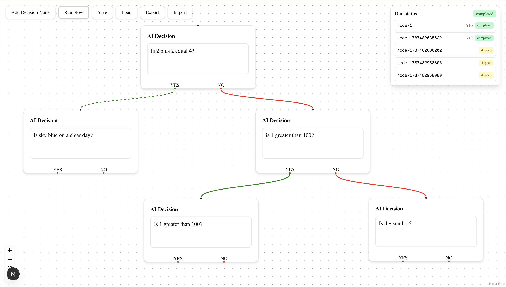

## Test 5, bad Gemini key, one attempt, fast failure

With an invalid API key, the classification check inside the `step.run` callback throws `NonRetriableError` on the first attempt. The Inngest trace shows a single attempt, not three, and the run fails in about a second instead of over a minute.

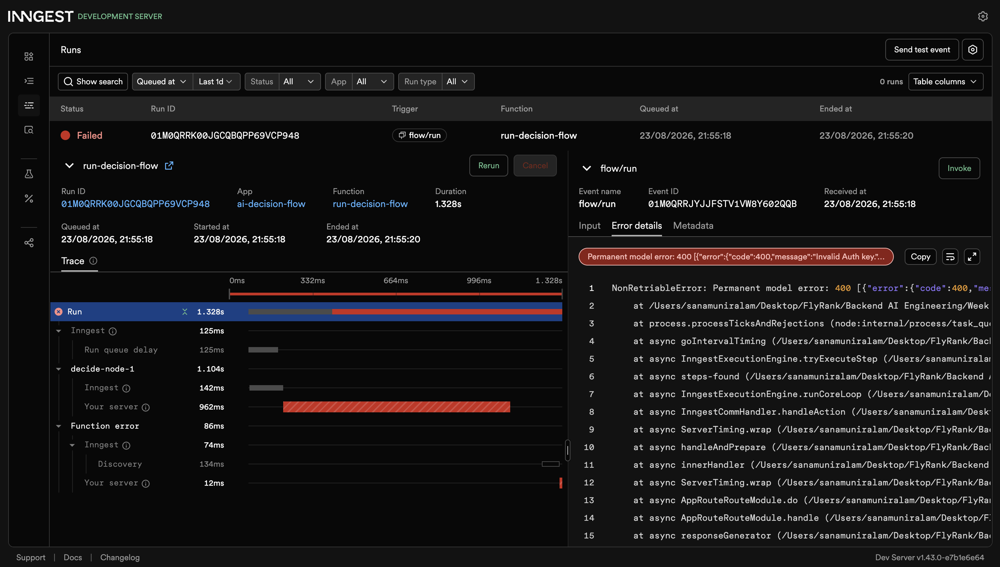

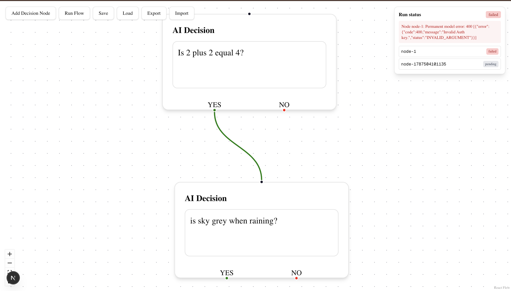

## Test 6, UI prevents a second incoming edge

Attempting to connect a second edge into a node that already has a parent silently fails to create the connection, the editor's `onConnect` guard rejects it before an edge is ever added to state. There is nothing to screenshot here, a connection that was never made leaves no visual trace, the enforcement is confirmed independently via Test 7's curl request against the same rule on the server.

## Test 7, curl, duplicate incoming edge rejected with 400

Sent a request directly to `/api/trigger-flow`, bypassing the UI, with two edges both targeting the same node.

```
curl X POST http://localhost:3000/api/trigger flow \
  H "Content Type: application/json" \
  d '{ ... two edges both targeting the same node ... }'
```

```
{"error":"Node node-1787470802397 has more than one incoming edge."}
```

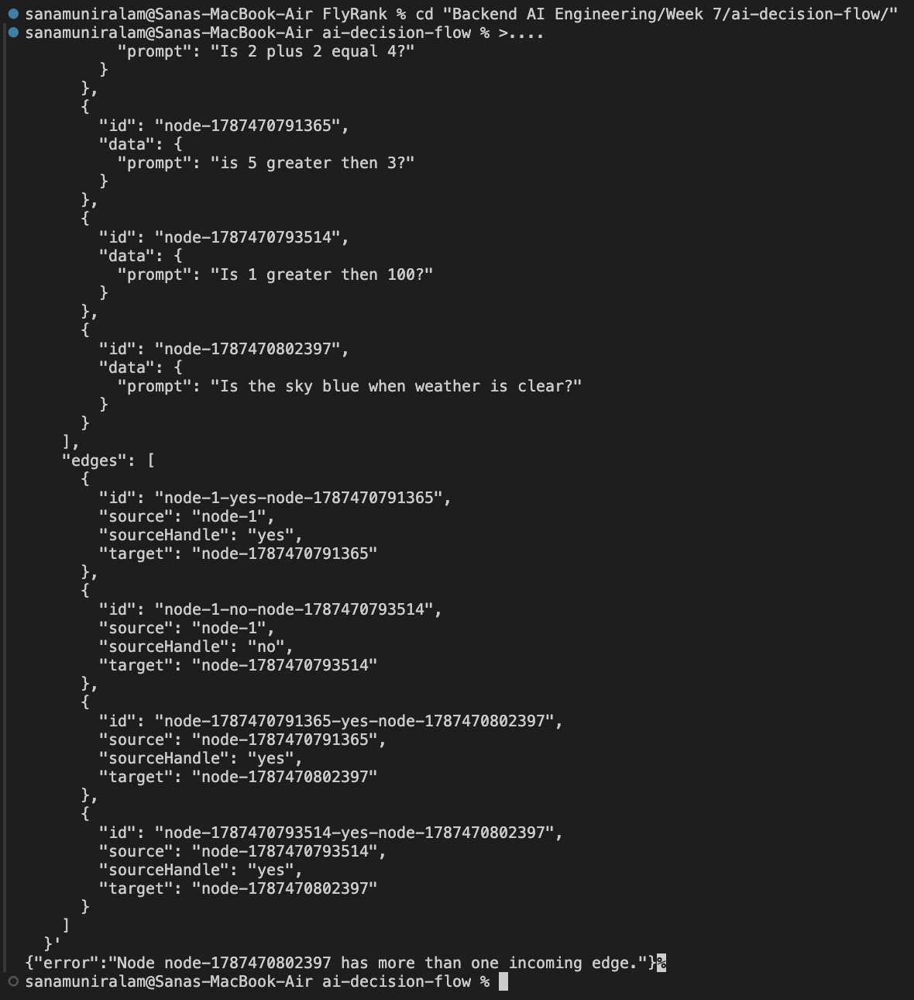

## Test 8, UI prevents multiple root nodes

Built two disconnected trees in the same canvas and attempted to run. Run Flow refuses with an explicit message naming the number of root nodes found, instead of silently picking one and leaving the other stuck at pending, which is what this build did before the fix.

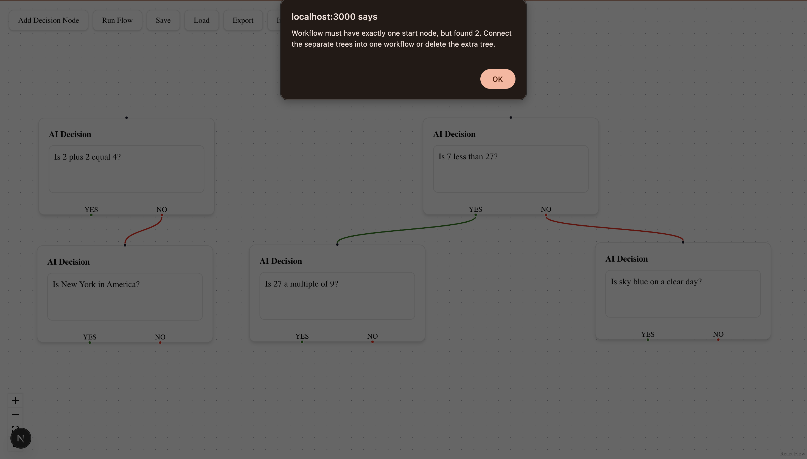

## Test 9, curl, multiple roots rejected with 400

Sent a workflow with two disconnected trees directly to the API.

```
{"error":"Workflow must have exactly one start node, but found 2."}
```

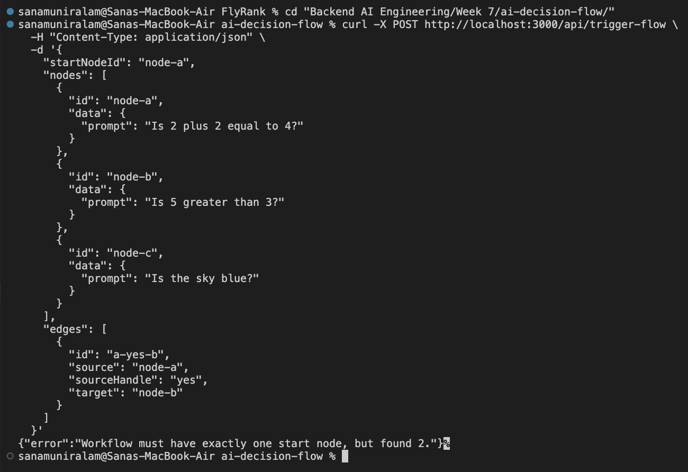

## Test 10, save, modify, load

Saved a workflow, made a visible change to the canvas, then loaded the saved workflow back and confirmed it reverted to exactly what was saved, discarding the unsaved change.

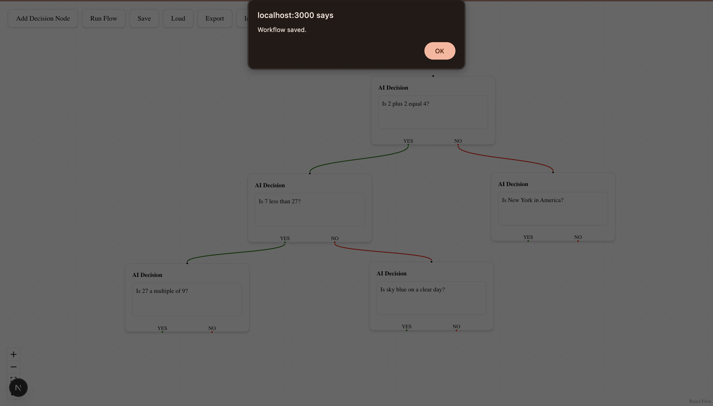

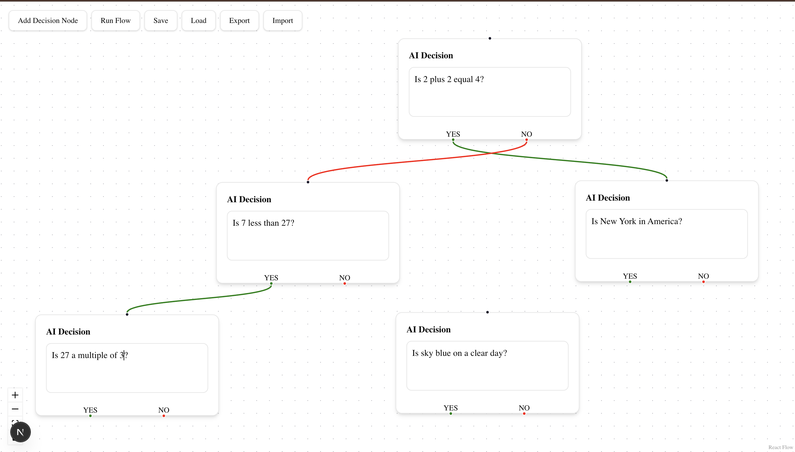

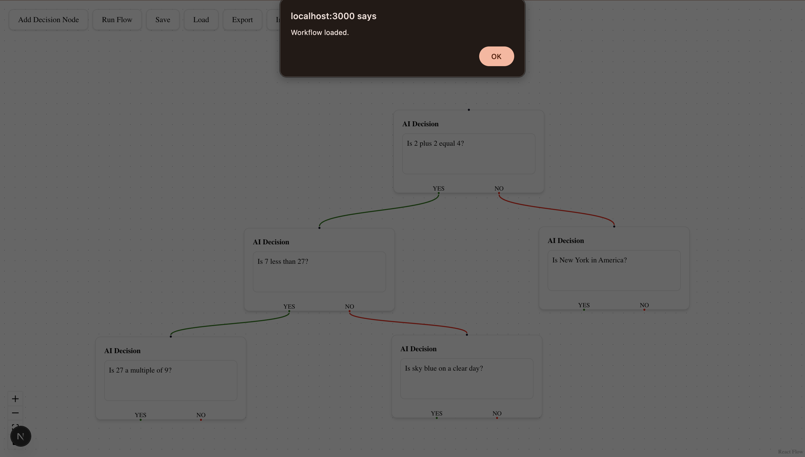

## Test 11, export, inspect the JSON

Exported the current graph and opened the downloaded file to confirm the structure matches `SavedFlow`, a version number, the node list with prompts, and the edge list with source, target, and source handle.

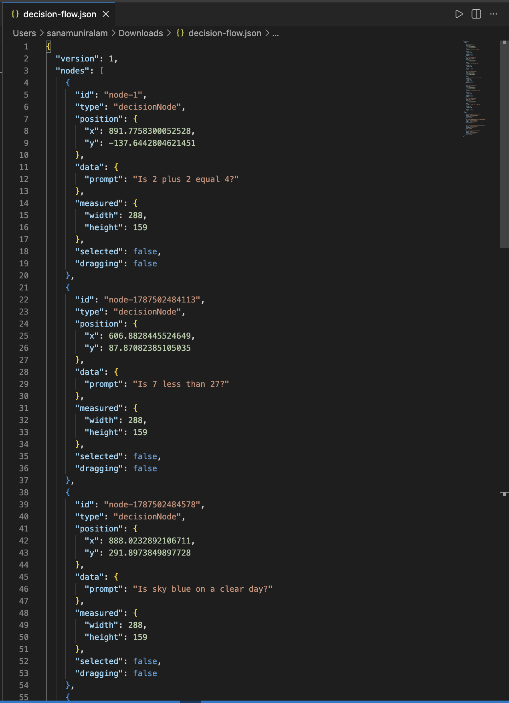

## Test 12, import valid JSON

Imported `fixtures/valid-flow.json`. The canvas rebuilt correctly from the file, matching the three node chain the file describes.

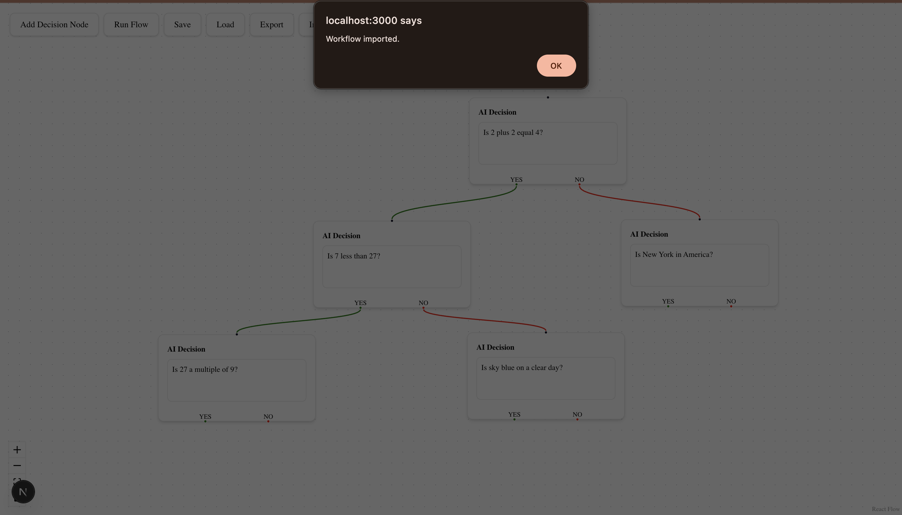

## Test 13, import malformed JSON

Imported `fixtures/bad-flow.json`, which fails to parse as JSON at all. `importFlow` catches the parse error and surfaces a clear message instead of crashing the app or silently doing nothing.

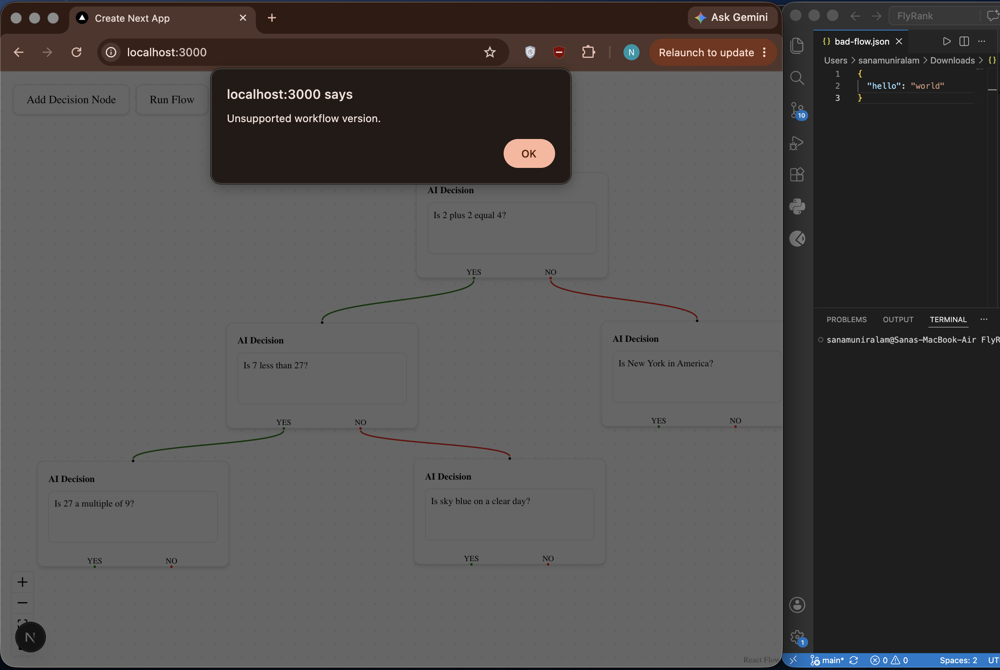

## Test 14, import a structurally invalid converging graph

Imported `fixtures/converging-graph.json`, valid JSON syntax, but two edges both target the same node. `validateFlow` rejects it with the same incoming edge rule used everywhere else in the app, confirming the import path enforces the tree invariant just as strictly as the trigger endpoint does.

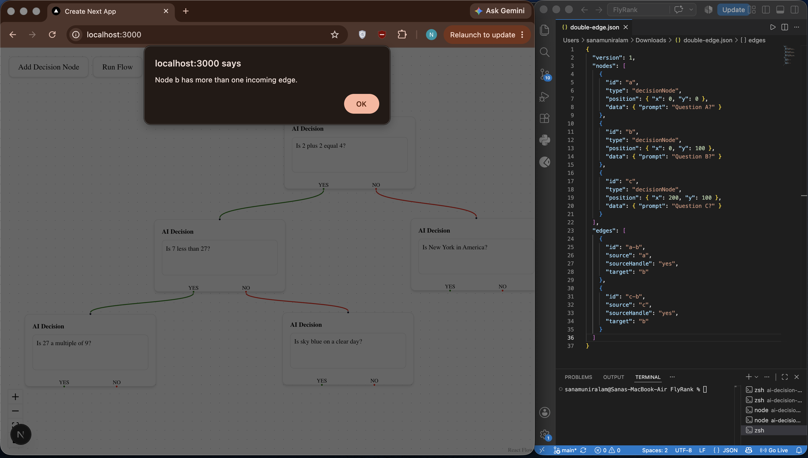