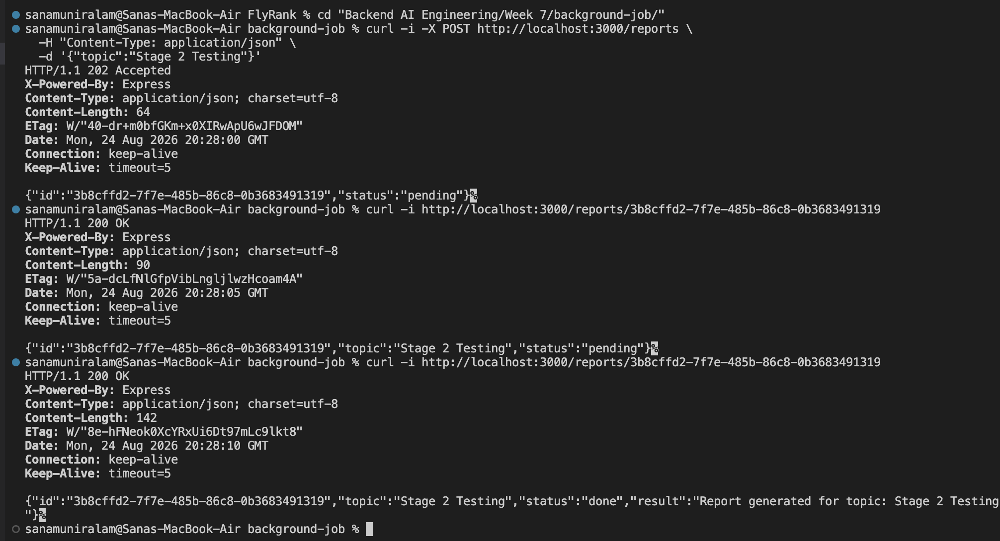
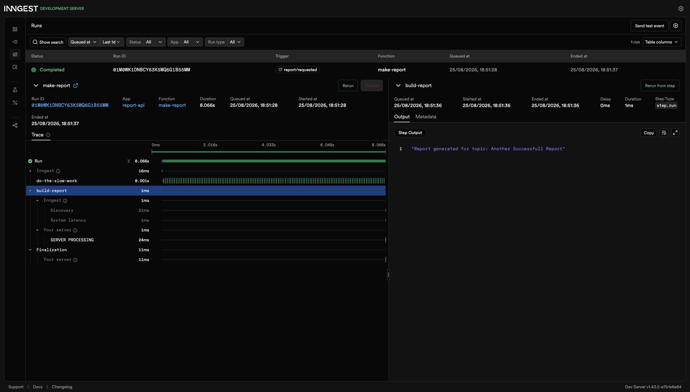
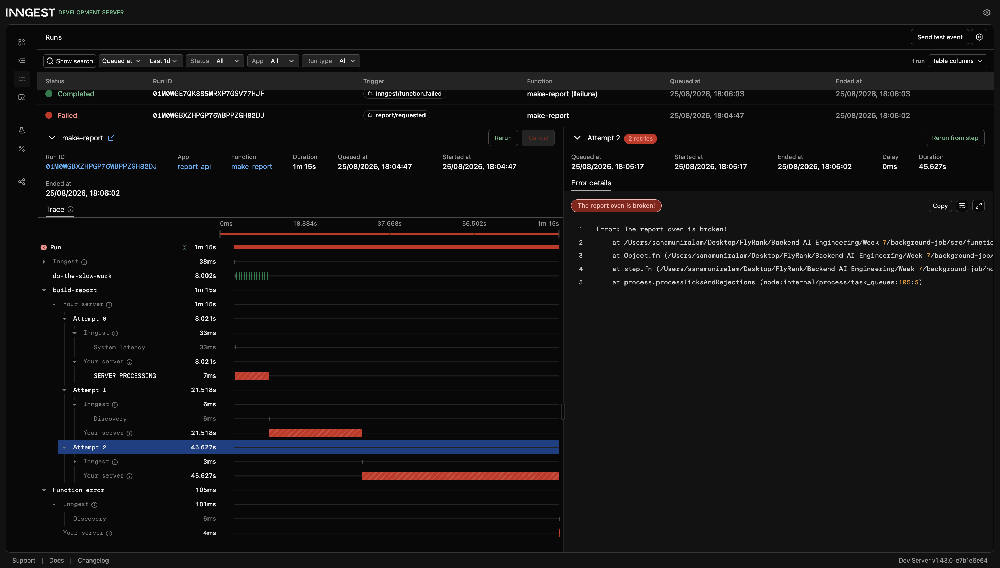
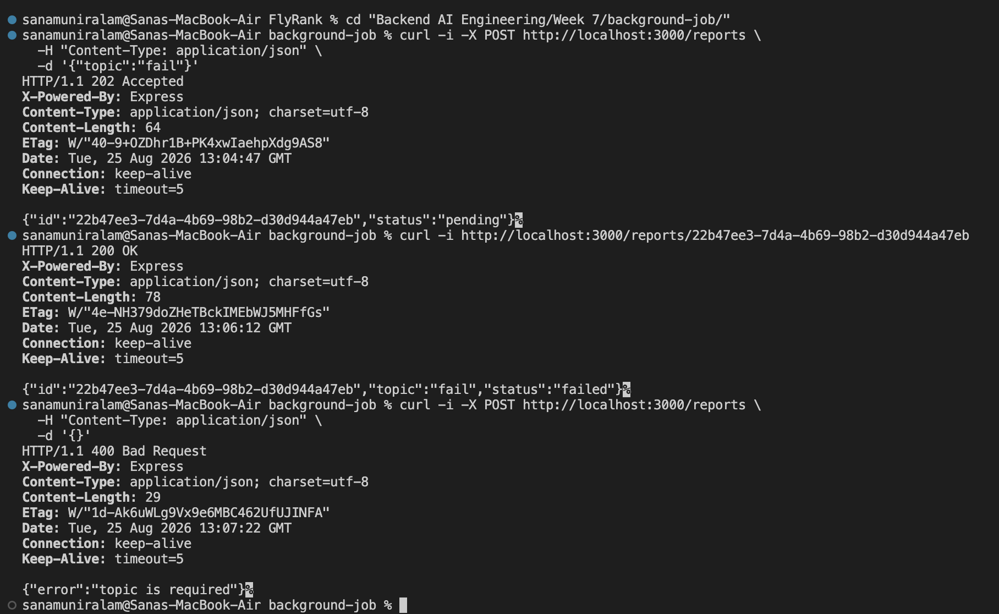
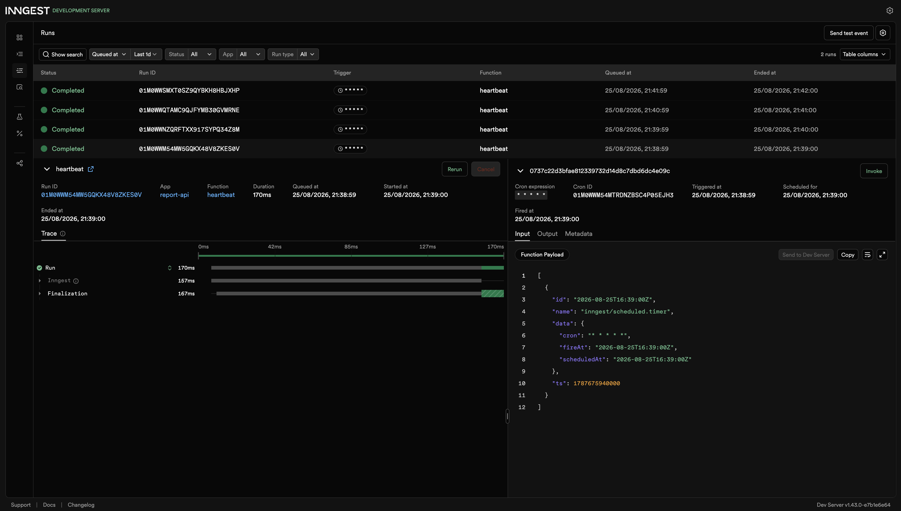

# Week 7: Your First Background Job

## 1. What it does

This project demonstrates how to move slow work out of an HTTP request and into a background job. The API accepts a report request immediately with `202 Accepted`, Inngest performs the work in the background, and a status endpoint allows the client to check when the report is ready. The project also demonstrates retries, failure handling, validation, and scheduled cron jobs.

## 2. How to run it

Clone the repository and open the `background-job` folder:

```bash
cd "Backend AI Engineering/Week 7/background-job"
```

The project uses Node.js and requires the following environment variable in `.env`:

```env
INNGEST_DEV=1
```

Run the API in the first terminal:

```bash
npm start
```

Run the Inngest Dev Server in a second terminal:

```bash
npx inngest-cli@latest dev -u http://localhost:3000/api/inngest
```

Both processes must remain running simultaneously. The API is available at `http://localhost:3000` and the Inngest dashboard is available at `http://localhost:8288`.

## 3. Endpoints and functions

| Name                                                                            | Type                     | What it does                                                                                                               |
| ------------------------------------------------------------------------------- | ------------------------ | -------------------------------------------------------------------------------------------------------------------------- |
| `GET /health`                                                                   | Endpoint                 | Confirms that the API is running.                                                                                          |
| `POST /reports`                                                                 | Endpoint                 | Validates the request, creates a pending report, sends a `report/requested` event, and immediately returns `202 Accepted`. |
| `GET /reports/:id`                                                              | Endpoint                 | Returns the current status and result of a report.                                                                         |
| `make-report`                                                                   | Event triggered function | Processes the report in the background, simulates slow work, builds the result, and supports retries and failure handling. |
| `heartbeat`                                                                     | Cron function            | Runs every minute and logs the number of pending, completed, and failed reports.                                           |
| `say-hello`                                                                     | Event triggered function | Created in Stage 1 to test the Inngest connection; not part of the report pipeline.                                        |

## 4. Proof: 202 then poll

The report endpoint responds immediately while the background job continues running.

```text
$ curl -i -X POST http://localhost:3000/reports \
  -H "Content-Type: application/json" \
  -d '{"topic":"Stage 2 Testing"}'
HTTP/1.1 202 Accepted
X-Powered-By: Express
Content-Type: application/json; charset=utf-8
Content-Length: 64
ETag: W/"40-dr+m0bfGKm+x0XIRwApU6wJFDOM"
Date: Mon, 24 Aug 2026 20:28:00 GMT
Connection: keep-alive
Keep-Alive: timeout=5

{"id":"3b8cffd2-7f7e-485b-86c8-0b3683491319","status":"pending"}%

$ curl -i http://localhost:3000/reports/3b8cffd2-7f7e-485b-86c8-0b3683491319
HTTP/1.1 200 OK
Content-Type: application/json; charset=utf-8

{"id":"3b8cffd2-7f7e-485b-86c8-0b3683491319","topic":"Stage 2 Testing","status":"pending"}%

$ curl -i http://localhost:3000/reports/3b8cffd2-7f7e-485b-86c8-0b3683491319
HTTP/1.1 200 OK
Content-Type: application/json; charset=utf-8

{"id":"3b8cffd2-7f7e-485b-86c8-0b3683491319","topic":"Stage 2 Testing","status":"done","result":"Report generated for topic: Stage 2 Testing"}%
```

The initial request is accepted immediately, the first poll shows `pending`, and a later poll shows the completed report.

## 5. Retries and validation

Invalid input should be rejected before a background job is created because retrying a request with missing required data will not fix the input; retries are intended for temporary failures during valid work.
The `make-report` function uses two retries, resulting in up to three attempts. When all attempts fail, the error is allowed to finish the function rather than being caught inside the `build-report` step, and the `onFailure` handler then marks the corresponding report as `failed`. This prevents a report from being marked failed after the first attempt while retries are still available.

## 6. Cron

The heartbeat function uses `* * * * *`, which runs once every minute for testing.
`0 8 * * *` runs every day at 08:00.
`0 22 * * 0` runs every Sunday at 22:00.

## 7. Inngest dashboard

The screenshots below provide evidence of the background jobs, retries, and scheduled functions.

### Report Creation and Status Progression


### Completed report



### Failed report with retries



### Failed report and Validation Test Curl


### Cron heartbeat


The dashboard shows the completed `make-report` execution with its steps, the failed execution with three attempts, and recurring heartbeat runs.

## 8. Notes and known limitations

Report data is stored in an in memory JavaScript `Map`, so all reports are cleared when the API process restarts. This is intentional for the assignment because the focus is on background jobs, events, retries, status reporting, and cron scheduling rather than persistent database storage.

## 9. Project Structure

```
background-job/
├── package-lock.json
├── package.json
├── screenshots
│   ├── Complete-Report.png
│   ├── Fail-Report-Stage3.png
│   ├── Stage 1.png
│   ├── Stage2.png
│   ├── Stage3_curl.png
│   └── cron.png
└── src
    ├── functions.js
    ├── inngest.js
    ├── reports.js
    └── server.js
```