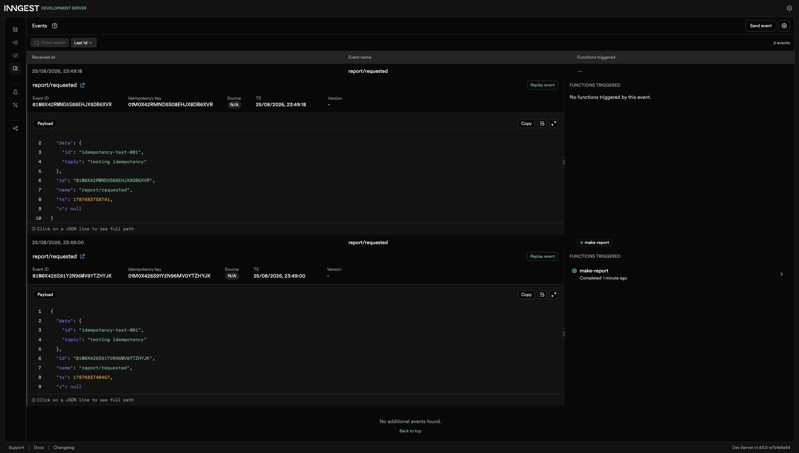
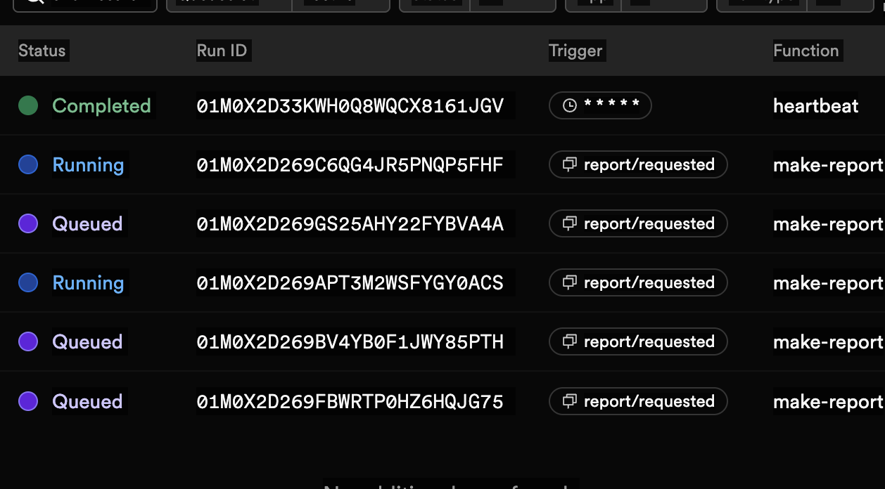
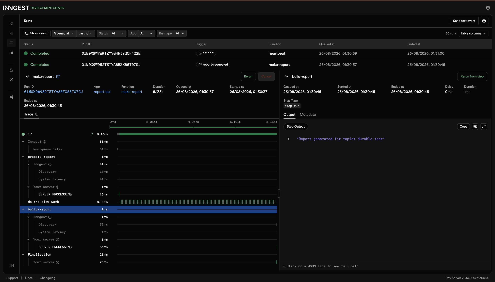

# Testing & Stretch Goals

This file holds the extended verification for the optional extras and stretch goals from the assignment. See `README.md` for the core assignment (Stages 0–5).

## Extras

- **List endpoint** — `GET /reports` returns all reports and their statuses.
- **The "email"** — `build-report` writes each completed report to `outbox/<id>.txt`, a stand-in for sending mail from a background job.

The screenshot shows three completed reports each with a matching `outbox/<id>.txt` file, and `GET /reports` listing all three as `done` with their results.

## Idempotency

**Setup:** `make-report` is configured with `idempotency: "event.data.id"`, so Inngest deduplicates events that share the same computed key. As a second, independent layer, `build-report` also checks `reports.get(id)?.status === "done"` before doing any work, in case a duplicate execution ever reaches the function body without being deduplicated at the event level (for example, a manually rerun step).

**Test:** the same `report/requested` event (fixed `id: "idempotency-test-001"`) was sent twice via the Inngest Dev Server's "Send test event" tool.

**Result:** the first event triggered `make-report`, which completed normally. The second, identical event shows **"No functions triggered by this event"** — Inngest's event-level dedup caught the duplicate before a second run was ever created. The Runs tab confirms exactly one `make-report` run exists for that id, `GET /reports/idempotency-test-001` shows a single `done` record, and only one file exists in `outbox/`.

**Caveat, stated honestly:** because the event-level dedup caught the duplicate first, the in-code `status === "done"` guard inside `build-report` was never actually exercised in this test — it exists as a defensive second layer for code paths that don't share the same idempotency key, not as something this specific test proved independently.

**Why this matters:** jobs will run twice someday — a network retry, a duplicate webhook, a client resending a request. If rebuilding a report duplicated file writes or side effects, a duplicate event could quietly corrupt state or double-charge a user. Idempotency means running the same job twice produces the same result as running it once.

## Concurrency limit

**Setup:** `make-report` is configured with `concurrency: { limit: 2 }`.

**Test:** 5 report requests were fired back-to-back via a shell loop.

**Result:** the dashboard shows 2 runs `Running` and 3 runs `Queued` at the same moment — Inngest enforced the cap exactly as configured, holding the remaining 3 back until a slot freed up.

**Why this matters:** a queue that's deliberately slow protects a downstream service (a rate-limited API, a database, a paid AI endpoint) from being overwhelmed by a burst of requests. Concurrency limits trade throughput for stability on purpose.

## Durability (restart survives an in-flight job)

**Setup:** `make-report` was extended to three steps — `prepare-report` (marks the report `pending`), `do-the-slow-work` (an 8-second sleep), and `build-report` (computes the result, writes to the outbox, marks the report `done`).

**Test:**
1. Sent `POST /reports` with a fresh topic.
2. Waited until `prepare-report` had completed and `do-the-slow-work` had started.
3. Killed the API process (`Ctrl-C`) immediately, and kept it down past the 8-second sleep window.
4. Restarted the API after roughly 10 seconds.

**Result:** the trace shows exactly what should happen:
- `prepare-report` ran once, completed, and never re-ran — it wasn't re-executed after the restart.
- `do-the-slow-work` completed on Inngest's own scheduler, independent of whether the API was up.
- `build-report` — **Attempt 0** failed with **"Unable to reach SDK URL"**, because the API was down at the exact moment Inngest tried to call back after the sleep finished.
- `build-report` — **Attempt 1**, once the API was back up, succeeded and returned the correct result.

**Two sentences for the record:** the job survived the crash even though the server didn't — only the step that was genuinely in-flight when the server went down had to retry, while the already-completed `prepare-report` step was never redone. This is durability: each finished step is checkpointed by Inngest, so a restart resumes the job rather than starting it over.

**One earlier attempt that didn't prove this, for honesty's sake:** the first restart test killed and restarted the server so quickly that the 8-second sleep had already finished before the API came back up — Inngest's callback never actually failed, so that run doesn't demonstrate durability, it only demonstrates that the app still works after a restart. The screenshot above is from the corrected test, where the server was kept down past the sleep window on purpose.