# Testing evidence — Stage 0 through Stage 5

This file contains the actual terminal output and screenshots proving each stage's checkpoint. See `README.md` for setup, architecture, and usage.

---

## Stage 0 — Setup

**Checkpoint:** `GET /health` returns `200`, and `playwright install chromium` finishes without errors.

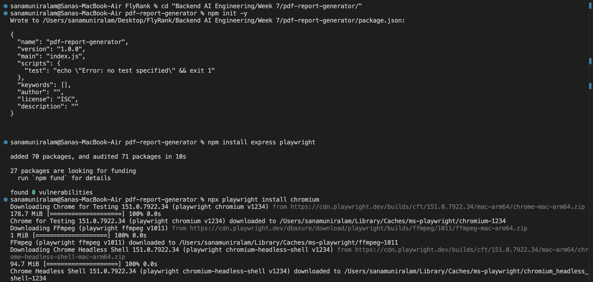

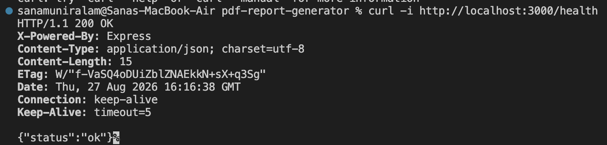

**Result:** Passed. Chromium, FFmpeg, and Chrome Headless Shell all downloaded with no errors.

---

## Stage 1 — Seeded database (bookstore, Option B)

**Checkpoint:** `SELECT COUNT(*)` → 60, even after seeding twice.

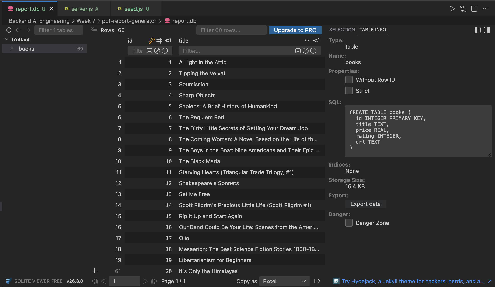

**First run:**

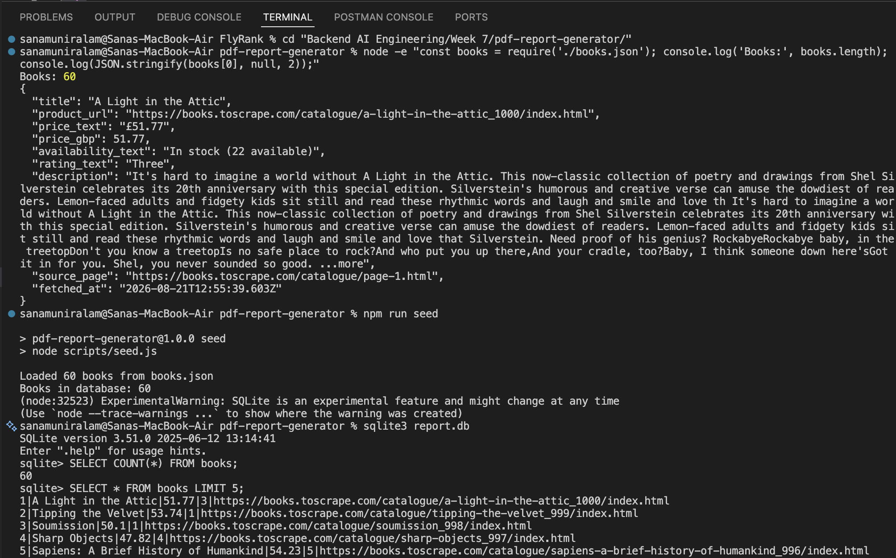

**Second run (proving the seed is safe to run twice — row count stays at 60, does not double):**

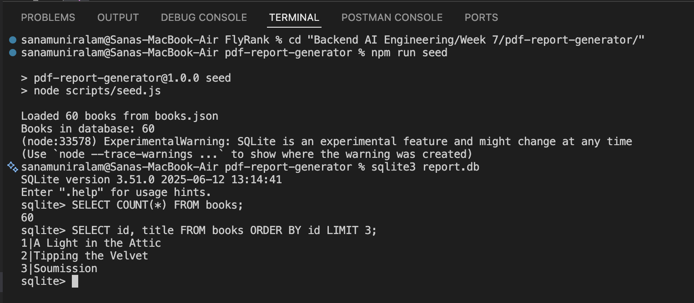

**Result:** Passed. Row count is 60 after both runs — the `DELETE FROM books` before insert works as intended.

---

## Stage 2 — Aggregation queries

**Checkpoint:** test script prints one JSON object with four populated sections and real numbers.

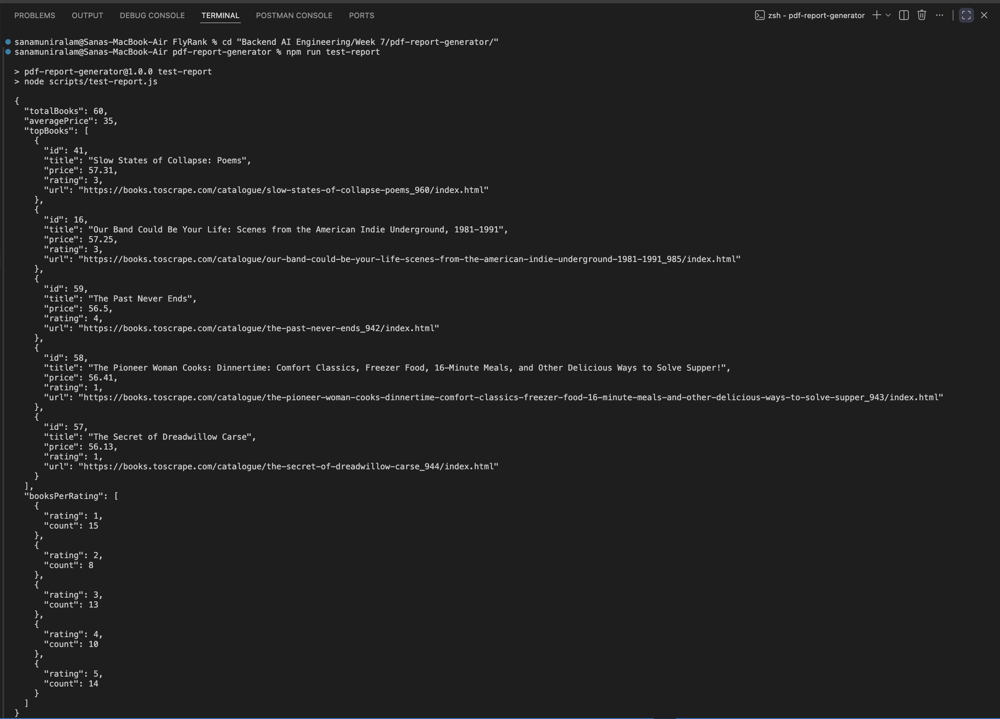

Full output:

```json
{
  "totalBooks": 60,
  "averagePrice": 35,
  "topBooks": [
    { "id": 41, "title": "Slow States of Collapse: Poems", "price": 57.31, "rating": 3 },
    { "id": 16, "title": "Our Band Could Be Your Life: Scenes from the American Indie Underground, 1981-1991", "price": 57.25, "rating": 3 },
    { "id": 59, "title": "The Past Never Ends", "price": 56.5, "rating": 4 },
    { "id": 58, "title": "The Pioneer Woman Cooks: Dinnertime...", "price": 56.41, "rating": 1 },
    { "id": 57, "title": "The Secret of Dreadwillow Carse", "price": 56.13, "rating": 1 }
  ],
  "booksPerRating": [
    { "rating": 1, "count": 15 },
    { "rating": 2, "count": 8 },
    { "rating": 3, "count": 13 },
    { "rating": 4, "count": 10 },
    { "rating": 5, "count": 14 }
  ]
}
```

**Sanity check:** `15 + 8 + 13 + 10 + 14 = 60` — matches `totalBooks`, confirming the `GROUP BY rating` query and the Stage 1 rating conversion are both correct.

**Result:** Passed.

---

## Stage 3 — HTML to PDF with clean page breaks

**Checkpoint:** `reports/test.pdf` opens, is ≥2 pages, no row cut in half, header repeats on both pages.

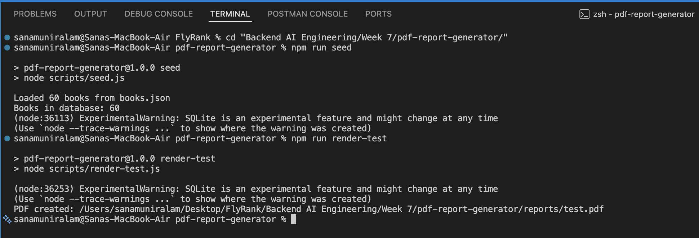

**Verification:** the "All Books" table breaks cleanly between row 12 (Shakespeare's Sonnets) and row 13 (Set Me Free) — no row is split across the page boundary — and the header row (`ID Title Price Rating`) reprints at the top of the next page. Confirmed by extracting the PDF's text content directly.

**Result:** Passed.

---

## Stage 4 — Generate and serve by link

**Checkpoint:** `time curl -i -X POST /reports` returns `201` + link after a visible pause; `curl -o my-report.pdf .../file` downloads a real PDF.

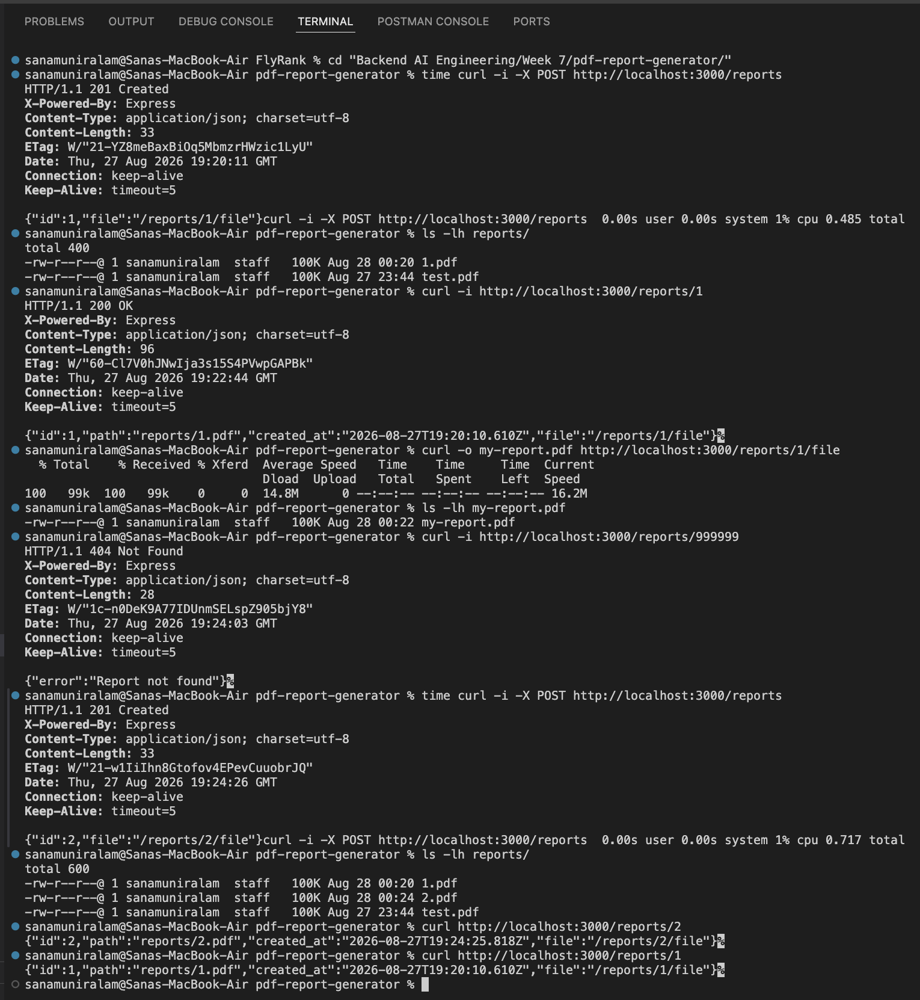

**Result:** Passed. Both POSTs took a visible sub-second-but-noticeable pause (0.485s / 0.717s) versus an effectively instant `/health` response — confirming the full pipeline (query → render → store) runs synchronously inside the request, as required. Each POST produced a distinct file (`1.pdf`, `2.pdf`), and the unknown-id case correctly returns `404`.

---

## Stage 5 — Duplicate requests make one report

**Checkpoint:** two rapid POSTs → same `id` in both responses, one new file in `reports/`. `{ "force": true }` → a new id.

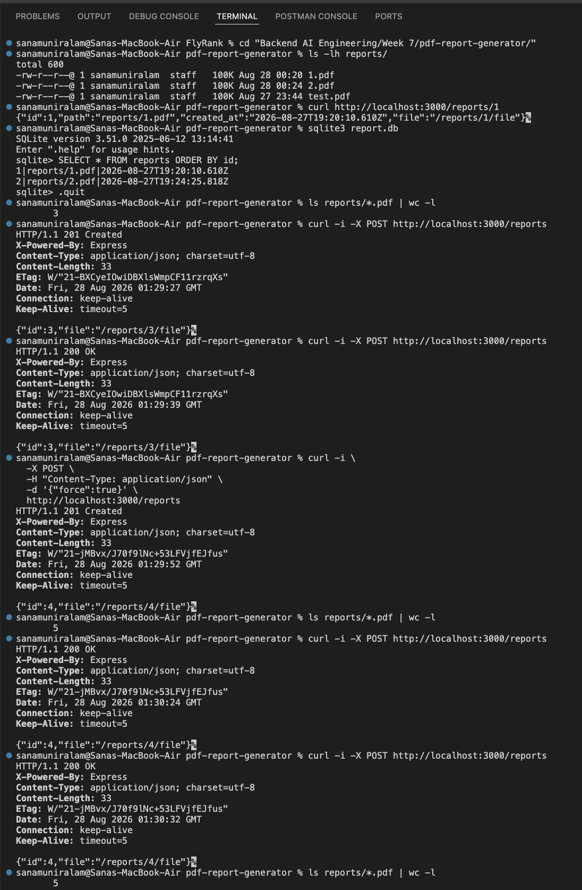

**Result:** Passed.

- First plain POST → `201`, new report (`id: 3`).
- Second plain POST, fired immediately after → `200`, same `id: 3`. No new file.
- `force: true` → `201`, new report (`id: 4`), file count rises 3 → 5.
- Two more plain POSTs after that → both `200`, `id: 4` (correctly picked up the *latest* report from today, not the stale `id: 3`). File count stays at 5.
- A second `force: true` → `201`, `id: 5`, file count rises to 6.

Status codes are correctly split throughout: `200` for "returned existing," `201` only when a new file was actually generated.

---

## Page 1 of a generated report

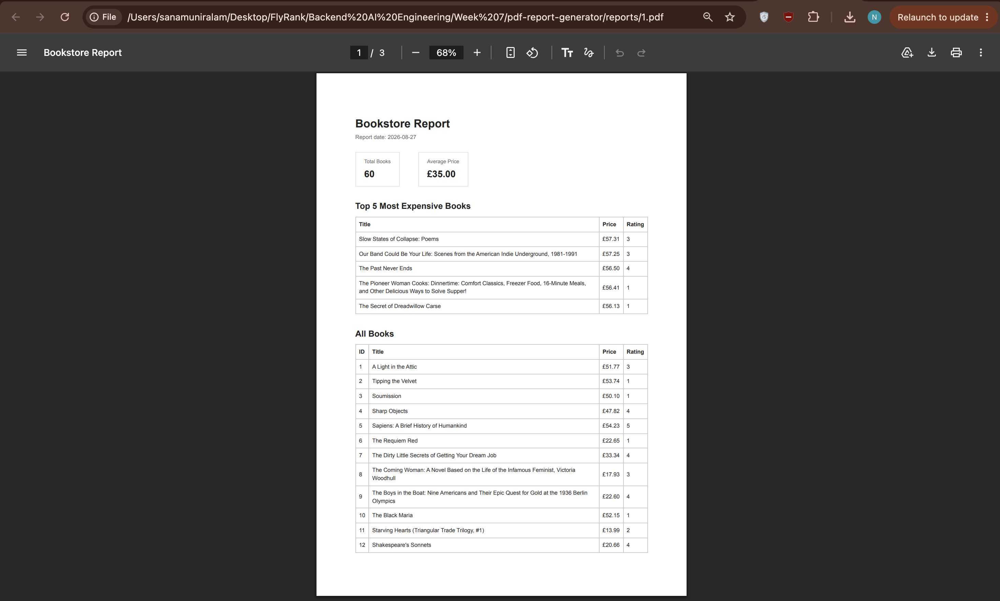

---

## Extra — Nice filenames

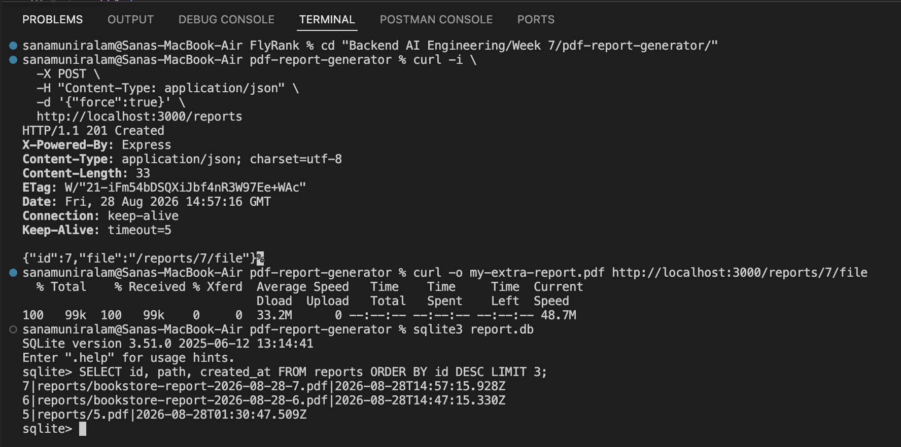

**Result:** Passed. New reports get the `bookstore-report-<date>-<id>.pdf` naming; older reports (`1.pdf`–`5.pdf`) were left as-is, which is expected — the change only applies going forward. `GET /reports/:id/file` still resolves correctly by `id`, confirmed by the successful download of `id: 7`.

---

## Extra — Parameterized report (`min_rating`)

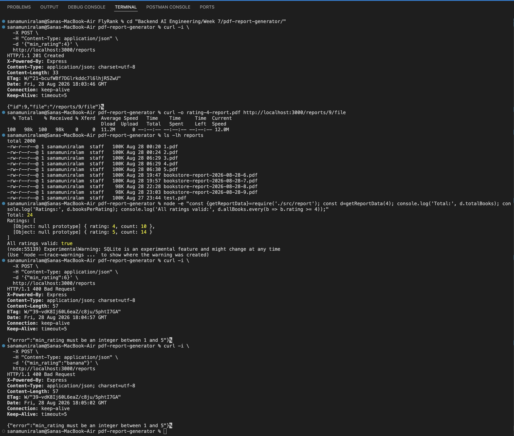

**Result:** Passed. `totalBooks: 24` and `10 + 14 = 24` — matches. Every row in the generated PDF's "All Books" table has rating 4★ or 5★, confirmed by both the `.every()` check and reading the PDF text directly. Invalid values (`6`, `"banana"`) are correctly rejected with `400`. The report title reflects the filter ("Books Rated 4★ and Above"). A `min_rating` request always generates a fresh report (new `id: 9`) rather than returning a cached unfiltered report — confirming the idempotency check correctly scopes to unfiltered requests only.

---

## Extra — Control panel (`GET /reports`)

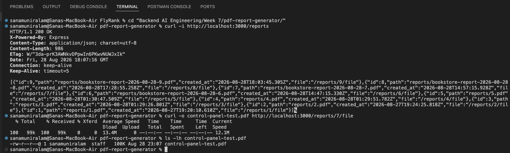

**Result:** Passed. All 9 reports returned, newest first, each with a working `file` link — verified by downloading `id: 7` directly from a link found in the list response, not just trusting the JSON shape.

---

## Extra — Styled PDF

The report was restyled with a branded header (logo mark, brand name, generation date), colored summary cards, alternating row shading, and a live page-number footer rendered via CSS paged media:

```css
@page {
  @bottom-center {
    content: "Bookstore Report  •  Page " counter(page) " of " counter(pages);
  }
}
```

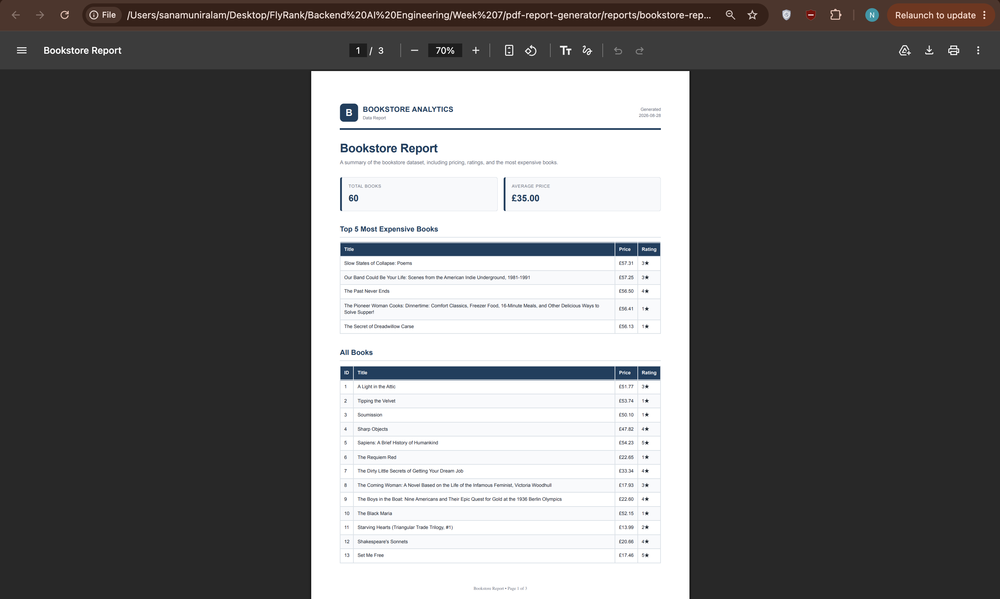

**Result:** Passed. The rendered PDF's footer reads "Bookstore Report • Page 1 of 3" through "Page 3 of 3" correctly across all pages — confirmed by extracting the PDF's text directly, not just that the CSS failed to error. This combines with the `min_rating` extra: the title dynamically shows "Books Rated 4★ and Above" when filtered.